信息收集 (Reconnaissance)

首先使用 Nmap 对目标进行端口扫描。

nmap -sS -p- 10.10.xx.xx

为了提高扫描效率，使用 SYN Scan (-sS) 进行快速扫描。

扫描结果发现：

端口	服务
22	SSH
1337	Web Server

说明目标为 Linux Web服务器。

2 Web 枚举

访问 Web 服务：

http://10.10.xx.xx:1337

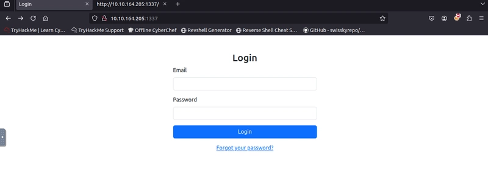

观察登录页面发现：

错误登录返回信息统一

提示 账户或密码错误

说明：

无法进行简单账号密码爆破。

3 忘记密码功能分析

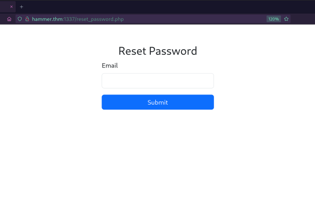

系统提供 密码找回功能。

测试发现：

输入不存在邮箱 → 返回 Invalid Email

存在邮箱 → 不同返回信息

因此：

该接口 可能存在用户名枚举漏洞。

可进行爆破,使用burp尝试爆破，发现存在速率限制，无法简单爆破

4 目录扫描

查看页面源代码发现：

网站目录命名规则：

hmr_DIRECTORY_NAME

于是使用 ffuf 进行模糊测试。

ffuf -w /usr/share/seclists/Discovery/Web-Content/common.txt \
-u http://10.10.xx.xx:1337/hmr_FUZZ

📷 ffuf扫描结果

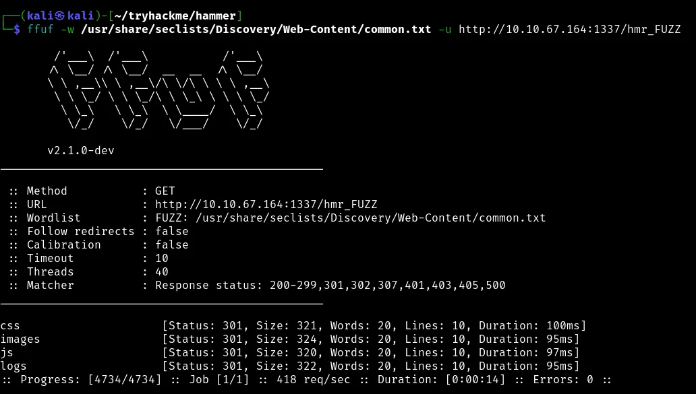

发现目录：

hmr_logs
5 日志文件泄露

访问目录：

http://10.10.xx.xx:1337/hmr_logs

发现日志文件：

error.logs

日志中泄露了一个有效邮箱：

tester@hammer.thm

6 密码重置功能分析

使用该邮箱进行 密码重置。

系统要求输入：

4位 OTP 验证码

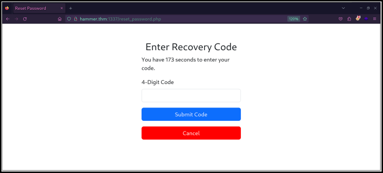

OTP范围：

0000 - 9999
7 速率限制分析

设置爆破字典

seq 0000 9999 >> codes.txt

使用 Burp Intruder 尝试爆破。

发现：

Rate-Limit-Pending

系统限制：

最多8次尝试

之后会自动退出。

8 绕过 Rate Limit

抓包分析发现：

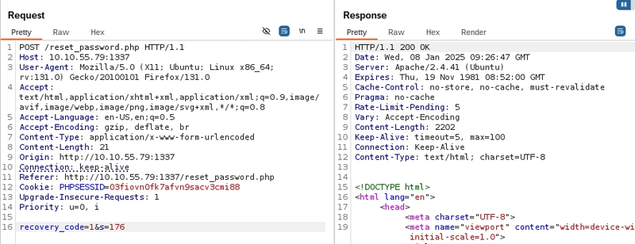

请求头中存在 IP识别机制。

缺少：

X-Forwarded-For

于是尝试添加：

X-Forwarded-For: 127.0.0.1

发现：

速率限制被重置。

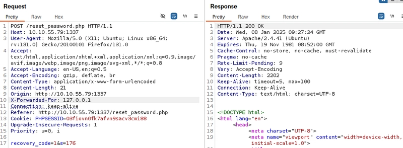

原因：

应用信任 HTTP Header中的IP。

因此可以 伪造IP绕过限制。

9 使用 ffuf 爆破 OTP

首先生成 OTP 字典：

seq -w 0000 9999 > numbers.txt

使用 ffuf 进行爆破：

ffuf -w numbers.txt \
-u http://10.10.xx.xx:1337/reset_password.php \
-X POST \
-d "recovery_code=FUZZ&s=60" \
-H "Cookie: PHPSESSID=SESSIONID" \
-H "X-Forwarded-For: FUZZ" \
-H "Content-Type: application/x-www-form-urlencoded" \
-fr "Invalid" \
-s

关键参数解释：

参数	说明
-w	字典
-X POST	POST请求
-d	POST数据
-H	添加Header
-fr	过滤响应
-s	静默模式

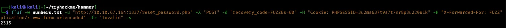

成功获得 OTP。

需要注意的是，这种方法能否成功完全取决于目标应用的代码实现：

不安全的应用：目标存在这类“信任HTTP头”的逻辑缺陷。可能直接使用 X-Forwarded-For 头中的值，而不做任何验证，这种情况下绕过成功率极高。

安全的应用：会通过 $_SERVER['REMOTE_ADDR'] （TCP连接的真实源IP）来获取客户端IP，X-Forwarded-For 头仅用于日志记录，不影响逻辑。此时这种绕过尝试无效。

配置正确的代理/负载均衡器：会正确地重置或验证这个头的值，防止欺骗。

方法二：使用自定义python脚本(otp_bruteforce.py)来进行绕过

脚本爆破流程

信息收集
    ->
目录扫描
    ->
日志泄露邮箱
    ->
密码重置
    ->
OTP爆破 (ffuf / Python)
    ->
登录系统
    ->
JWT伪造
    ->
权限提升
    ->
获取 Flag

10 登录系统

使用 OTP 重置密码并登录。

登录后发现：

一个 命令执行界面。

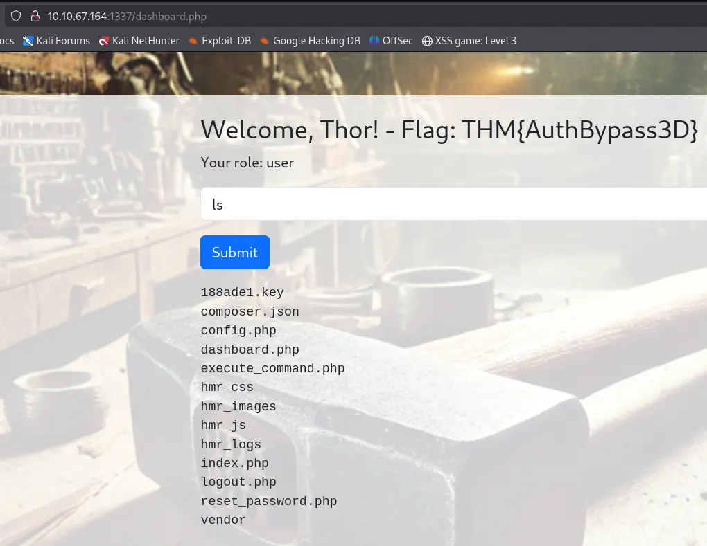

11 会话 Token 分析

抓包发现：

系统使用 JWT Token。

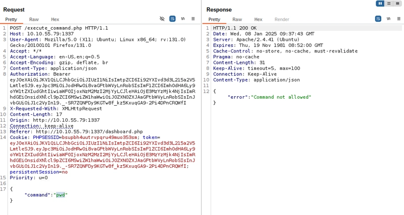

使用token处理网站进行token分析

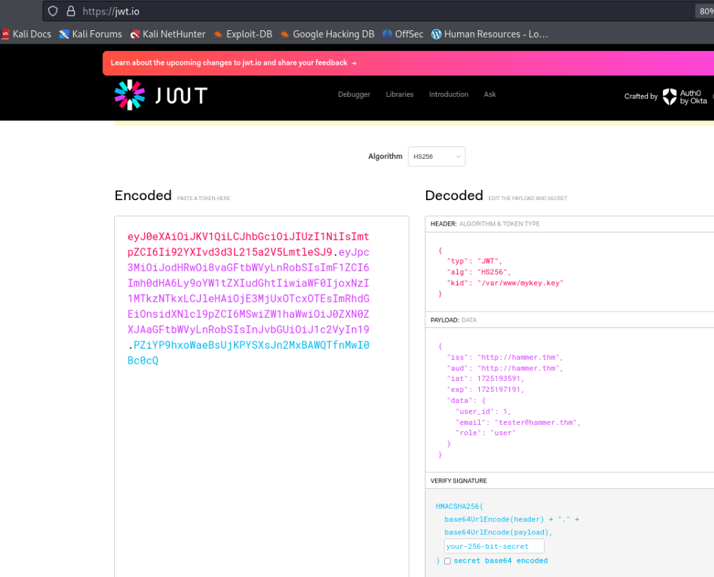

发现：

token包含 role

使用 HS256

设置了一个 kid，它指向位于 /var/www/mykey.key 的密钥文件

JWT Header：

{
 "alg": "HS256",
 "kid": "/var/www/mykey.key"
}

12 JWT漏洞利用

在命令执行界面执行：

ls

发现文件：

188ade1.key

尝试访问：

http://10.10.xx.xx:1337/188ade1.txt

成功下载密钥。

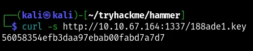

13 JWT权限提升

修改 JWT：

Header

kid: /var/www/html/188ade1.key

Payload

role: admin

并使用泄露的密钥重新签名。

生成新的 JWT。

14 获取 Flag

将新 Token 替换：

Authorization Header

Cookie

然后执行命令：

cat /home/ubuntu.flag.txt

成功获取 Flag。

攻击路径总结

完整攻击流程：

Nmap扫描
      ↓
目录扫描
      ↓
日志泄露邮箱
      ↓
密码重置
      ↓
OTP爆破
      ↓
绕过速率限制
      ↓
登录系统
      ↓
JWT分析
      ↓
密钥泄露
      ↓
JWT伪造
      ↓
命令执行
      ↓
获取Flag
