cve-2018-2894

搭建靶场

以给的密码登录后台，点击base_domain -> 高级 -> 启用Web服务测试页 -> 保存

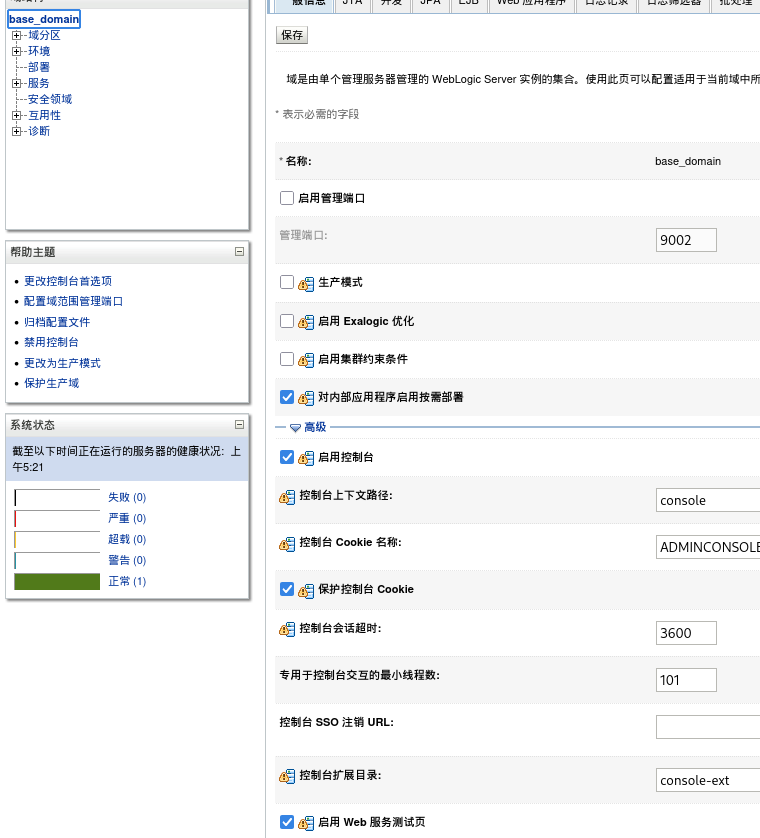

访问/ws_utc/config.do（一个未授权访问路径）

设置 Work Home Dir 为：

/u01/oracle/user_projects/domains/base_domain/servers/AdminServer/tmp/_WL_internal/com.oracle.webservices.wls.ws-testclient-app-wls/4mcj4y/war/css

使用哥斯拉生成一个shell

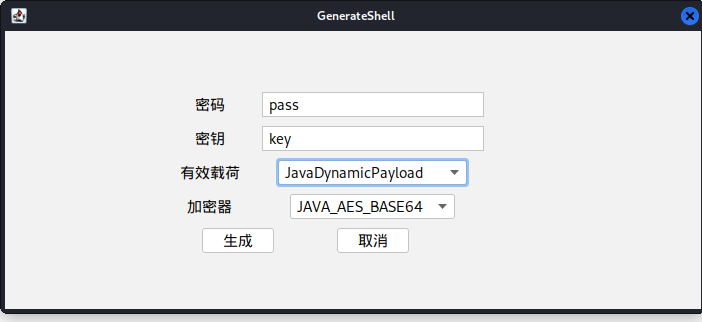

依次点击安全->添加，来上传这个shell

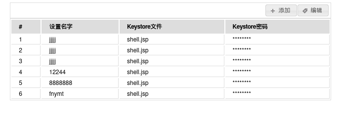

使用浏览器检测源码，获取到一个时间戳

上传路径为 http://you-ip/ws_utc/css/config/keystore/[时间戳]_[文件名]

访问url测试上传成功没

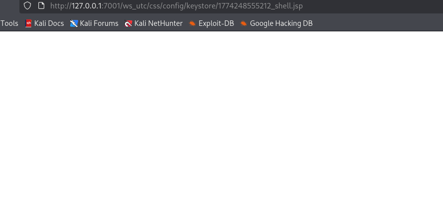

上传成功，开启哥斯拉建立连接

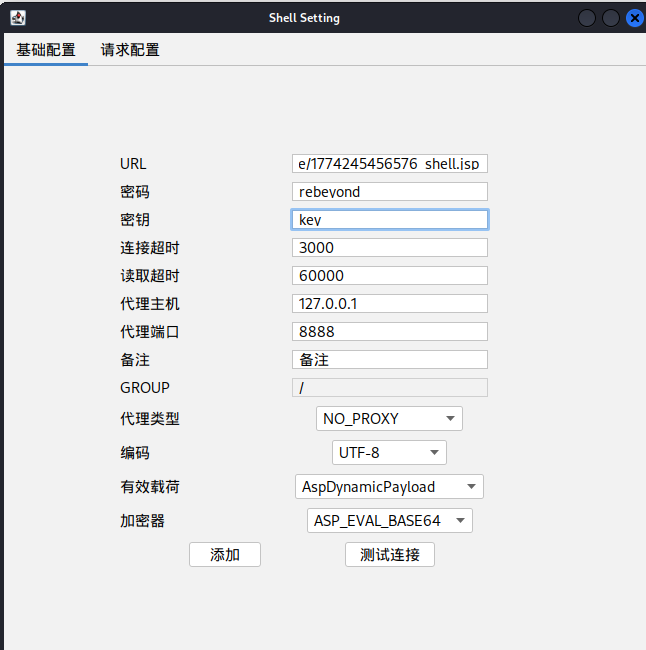

成功

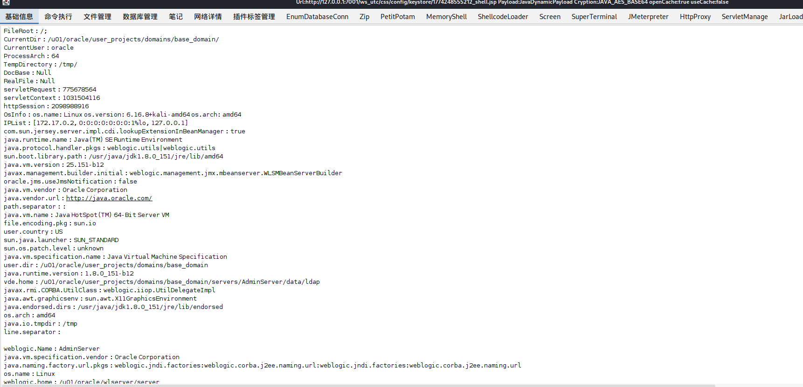

弱口令漏洞

使用weblogic/Oracle@123弱口令登陆后台

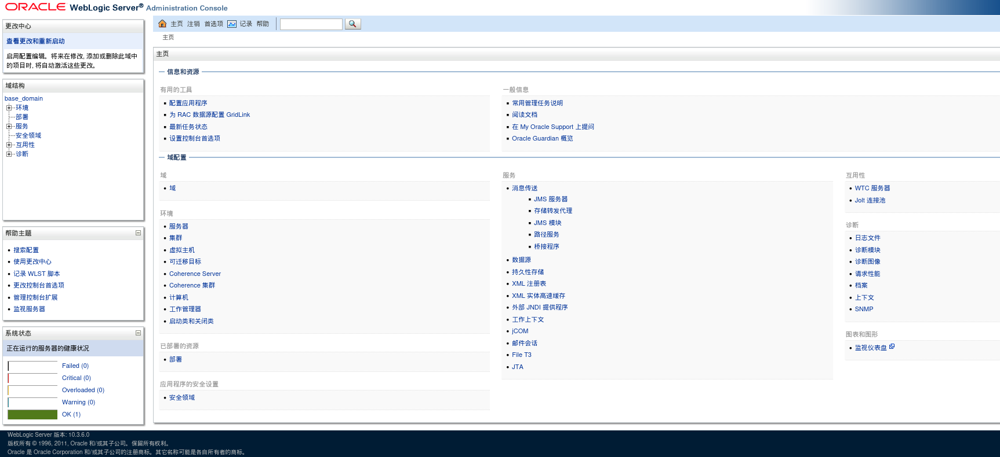

依次点击部署->安装->上传文件

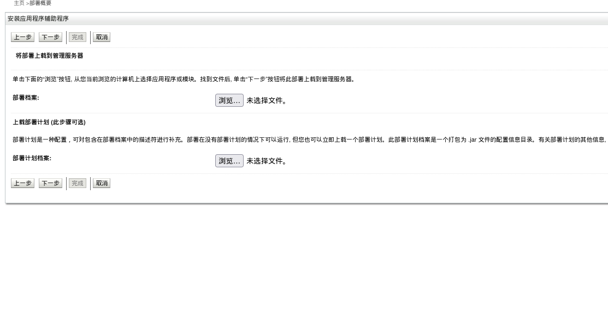

上传一个打包了shell的war

打包指令如下

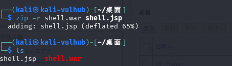

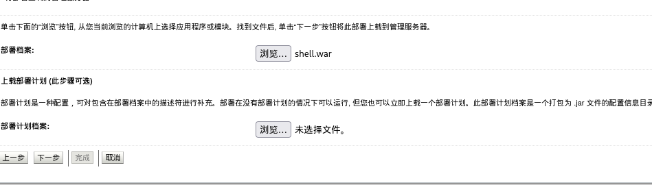

然后一直点下一步和完成

成功上传

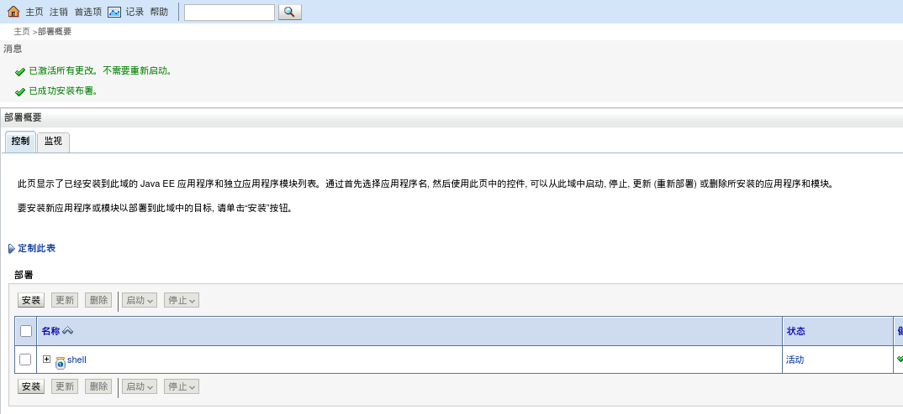

然后在哥斯拉中配置连接

路径为war名/包中的shell文件名 所以为shell/shell.jsp

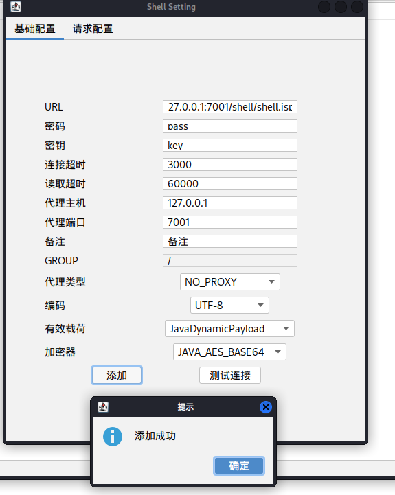

连接成功

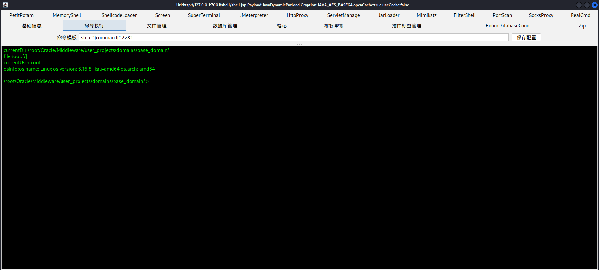

CVE-2017-10271

访问http://192.168.1.10:7001/wls-wsat/CoordinatorPortType

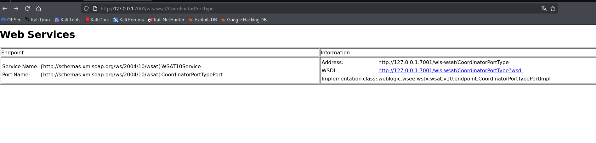

使用burpsuit抓包，修改包为下图

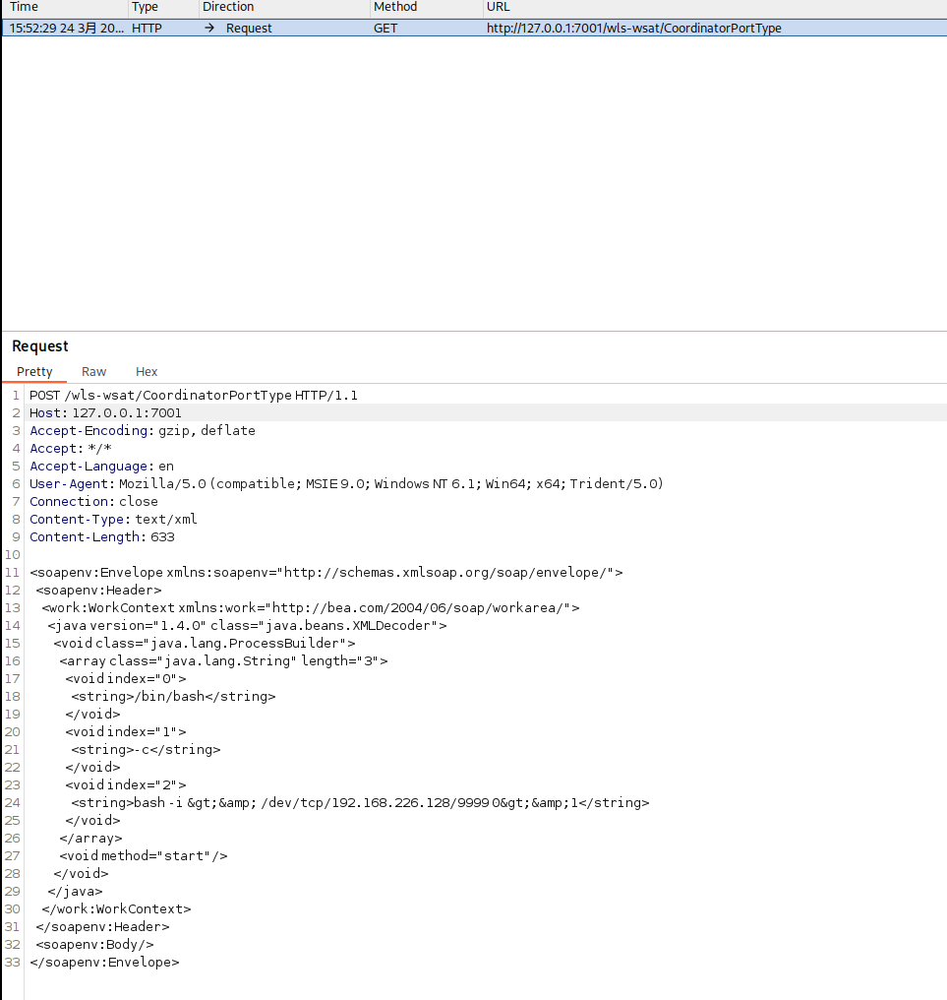

成功注入的化页面会返回下图

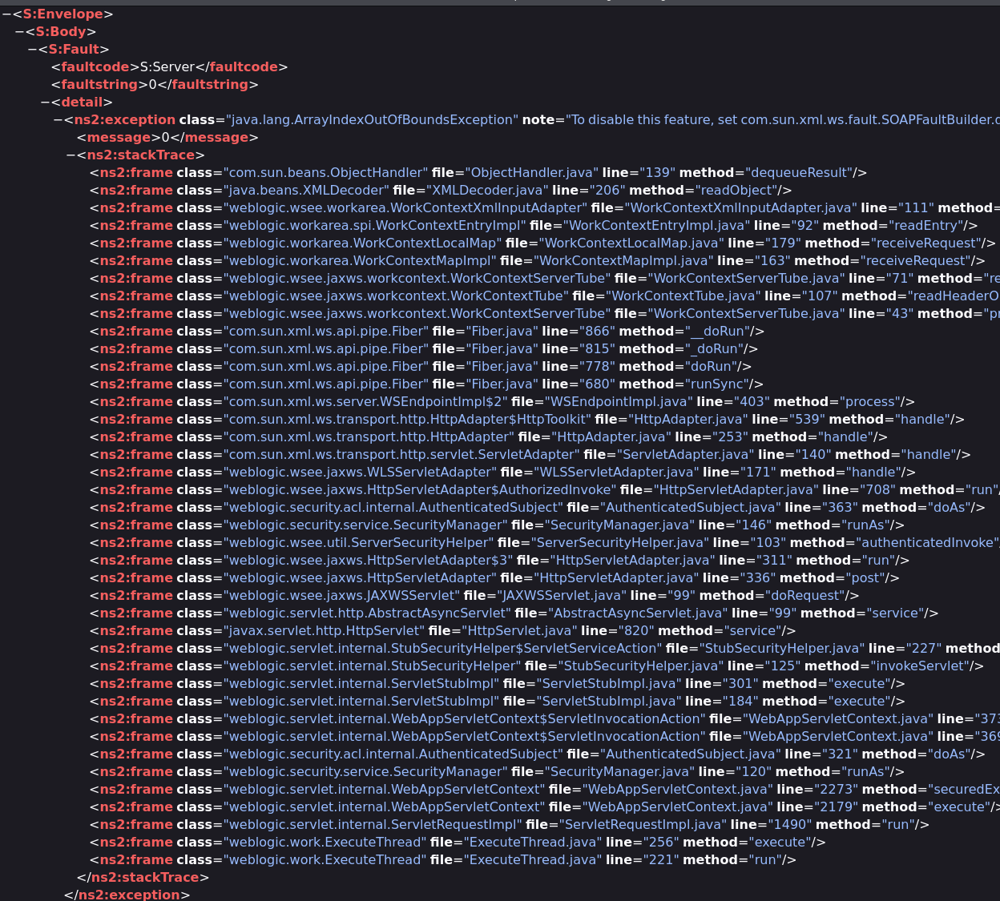

nc监听到回传请求

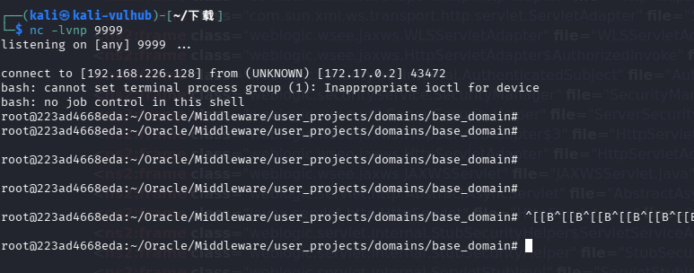

或者使用weblogictools来测试目标url

检测到漏洞

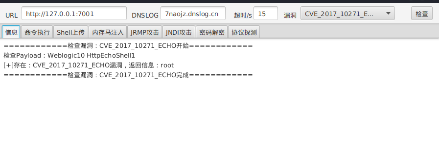

进行利用

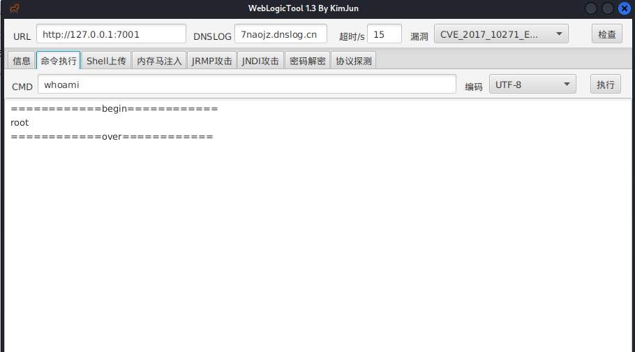

cve-2018-2628

使用的是https://github.com/Lighird/CVE-2018-2628的漏洞检测包复现

先使用漏洞检测脚本CVE-2018-2628-MultiThreading.py

将url.txt设置为目标机，端口

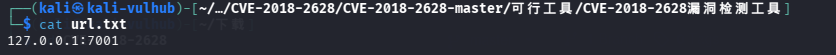

确认存在漏洞

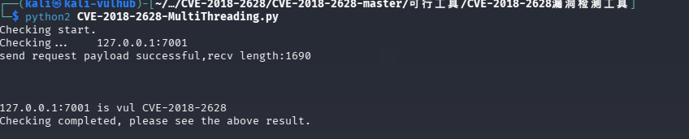

之后开始进行利用

开启JRMP服务，让weblogic服务器远程调用，使用的是ysoserial-0.1-cve-2018-2628-all.jar工具

但在这之前要先编码反射shell的指令

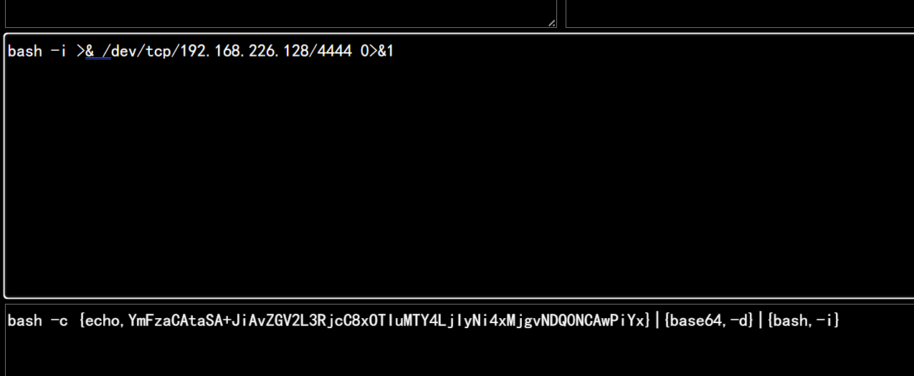

之后开启jrmp服务

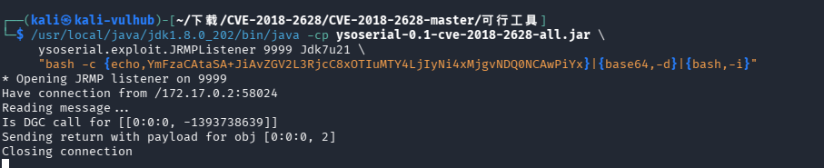

依旧利用此工具，生成连接jrmp服务器的载荷

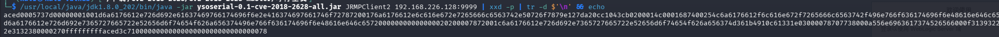

再编辑poc脚本weblogic_poc.py 

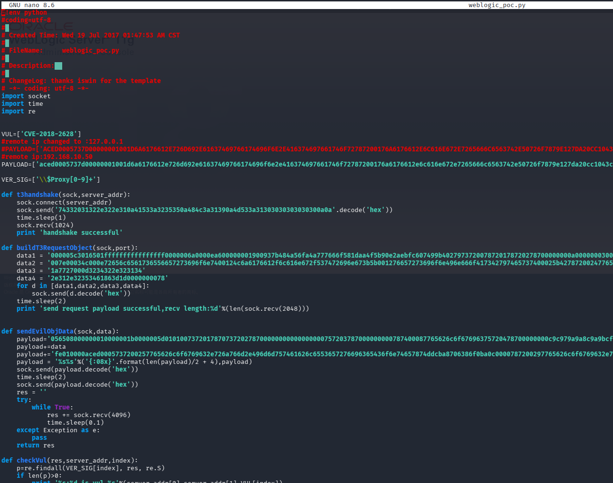

调用此脚本

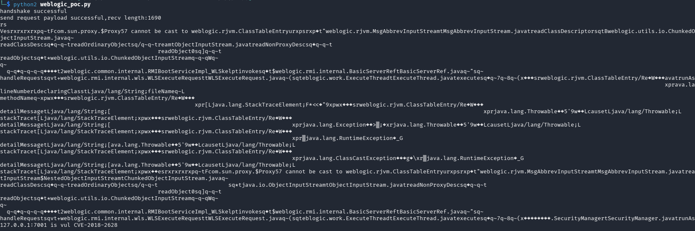

设置监听并成功收到连接

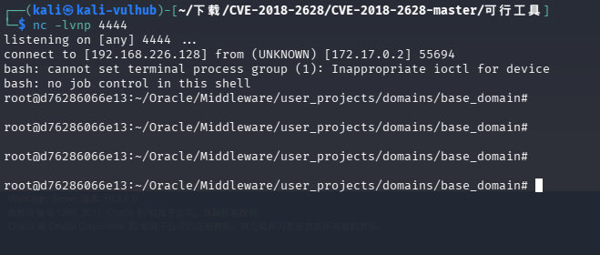

